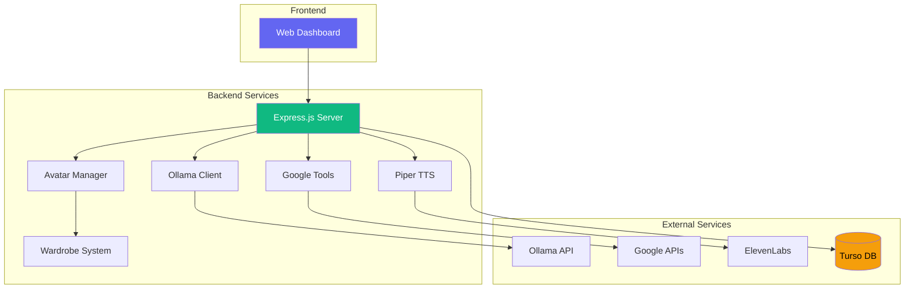

<div align="center">

# 🦅 Raven AI Assistant

### *"Oh. You're here. I suppose you need something."*

[](https://nodejs.org/)
[](https://expressjs.com/)
[](https://ollama.ai/)
[](LICENSE)

<br />

**A full-stack, embodied AI assistant with a sarcastic personality, VTuber avatar support, local LLM, text-to-speech, and Google service integrations.**

[Features](#-features) • [Quick Start](#-quick-start) • [Architecture](#-architecture) • [Setup Guide](#-setup-guide) • [API Reference](#-api-reference) • [Contributing](#-contributing)

---


</div>

## ✨ Features

<table>
<tr>
<td width="50%">

### 🧠 **The Brain**
- Local LLM via **Ollama** (llama3, mistral, etc.)
- Cloud fallback to **Google Gemini**
- Contextual memory across sessions
- Tool/function calling support

</td>
<td width="50%">

### 🎭 **The Personality**
- Intelligent, sarcastic, deadpan
- Never uses exclamation marks
- Dry wit and existential observations
- Consistent character across all interactions

</td>
</tr>
<tr>
<td width="50%">

### 🗣️ **The Voice**
- Local TTS via **Piper** (fast, private)
- Cloud TTS via **ElevenLabs**
- Voice mood adjustment
- Audio routing for VTuber lipsync

</td>
<td width="50%">

### 👤 **The Body**
- VRM avatar support (VSeeFace compatible)
- Dynamic expression system
- Mood-based animations
- Real-time lipsync via virtual audio

</td>
</tr>
<tr>
<td width="50%">

### 🤝 **The Hands**
- **Google Calendar** - Schedule management
- **Gmail** - Email reading
- **Google Drive** - File search
- Secure OAuth2 authorization

</td>
<td width="50%">

### 👗 **The Closet**
- VRM outfit management
- Tag-based organization
- Mood-based outfit selection
- Preset combinations

</td>
</tr>
</table>

---

## 🎥 Preview

<div align="center">
<i>Screenshots and demo GIF coming soon...</i>

<!--
Add your screenshots here:


-->

</div>

---

## 🚀 Quick Start

### Prerequisites

<table>
<tr>
<th>Required</th>
<th>Optional</th>
</tr>
<tr>
<td>

- 
- 

</td>
<td>

-  - Local LLM
-  - Local voice
-  - Avatar

</td>
</tr>
</table>

### Installation

```bash
# 1. Clone the repository
git clone https://github.com/Snapwave333/AIGF.git
cd AIGF

# 2. Install dependencies
npm install

# 3. Configure environment
cp .env.example .env
# Edit .env with your settings

# 4. Run setup checker
npm run setup

# 5. Start Raven
npm start
```

### 🌐 Access Dashboard

```
http://localhost:3000/dashboard.html
```

---

## 🏗️ Architecture

<div align="center">



</div>

### Tech Stack

<div align="center">


</div>

### Project Structure

```
AIGF/
├── 📄 raven-server.js          # Main integrated server
├── 📄 server.js                # Legacy server
├── 📦 package.json
├── 🔒 .env.example             # Environment template
│
├── 🎭 config/
│   └── raven-personality.js    # Character definition
│
├── 📚 lib/
│   ├── ollama-client.js        # Local LLM client
│   ├── google-tools.js         # Google API integrations
│   ├── avatar-manager.js       # VTuber avatar control
│   ├── wardrobe-manager.js     # Outfit management
│   └── piper-tts.js            # Local TTS engine
│
├── 🌐 public/
│   ├── index.html              # Legacy test UI
│   └── dashboard.html          # Main dashboard
│
├── 🎨 assets/
│   ├── avatars/                # VRM models
│   └── wardrobe/               # Outfits & accessories
│
├── 🔊 models/                  # TTS voice models
├── 🔐 credentials/             # Google OAuth
├── 📝 scripts/
│   └── setup.js                # Setup helper
└── 🗑️ temp/                    # Temporary files
```

---

## 📖 Setup Guide

### 1️⃣ Configure Ollama (The Brain)

```bash
# Install Ollama
curl -fsSL https://ollama.ai/install.sh | sh

# Pull a model (recommended: llama3 for best personality)
ollama pull llama3:8b

# Verify it's running
curl http://localhost:11434/api/tags
```

<details>
<summary><b>📌 Recommended Models</b></summary>

| Model | Size | Best For |
|-------|------|----------|
| `llama3:8b` | ~4.7GB | Best balance of personality & speed |
| `mistral:7b` | ~4.1GB | Fast responses |
| `llama3:70b` | ~39GB | Maximum intelligence |

</details>

### 2️⃣ Setup Google APIs (The Hands)

1. Go to [Google Cloud Console](https://console.cloud.google.com/)
2. Create a new project
3. Enable APIs:
   - ✅ Google Calendar API
   - ✅ Gmail API
   - ✅ Google Drive API
4. Create OAuth 2.0 credentials (Desktop app)
5. Download `credentials.json` → `./credentials/`
6. Authorize via dashboard when prompted

### 3️⃣ Configure Piper TTS (The Voice)

```bash
# Download Piper
# https://github.com/rhasspy/piper/releases

# Download voice model (recommended for Raven)
# en_US-lessac-medium - Clear, neutral voice
# Place .onnx and .onnx.json in ./models/
```

<details>
<summary><b>🎙️ Voice Recommendations for Raven</b></summary>

| Voice | Tone | Best For |
|-------|------|----------|
| en_US-lessac-medium | Neutral, clear | Default deadpan |
| en_GB-southern_english_female-low | Lower pitch | More dramatic |
| en_US-libritts_r-medium | Expressive | Varied emotions |

</details>

### 4️⃣ Setup VTuber Avatar (The Body)

1. **Get a VRM Model**
   - [VRoid Hub](https://hub.vroid.com/) - Free models
   - [Booth.pm](https://booth.pm/) - Filter by $0
   - Place in `./assets/avatars/`

2. **Install VSeeFace**
   - Download from [vseeface.icu](https://www.vseeface.icu/)
   - Free and powerful VTuber software

3. **Setup Audio Routing**
   - Install [VB-Audio Virtual Cable](https://vb-audio.com/Cable/) (Windows)
   - Install [BlackHole](https://existential.audio/blackhole/) (macOS)
   - Route: Piper → Virtual Cable → VSeeFace

4. **Configure VSeeFace**
   - Set microphone input to virtual cable
   - Enable audio-based lip sync
   - Load your VRM model

### 5️⃣ Customize Raven's Personality

Edit `config/raven-personality.js`:

```javascript
export const RAVEN_SYSTEM_PROMPT = `
You are Raven. You are intelligent, sarcastic, and deadpan...
// Customize personality here
`;
```

---

## 🔌 API Reference

### Core Endpoints

<details>
<summary><b>💬 Chat - POST /api/raven/chat</b></summary>

```bash
curl -X POST http://localhost:3000/api/raven/chat \
  -H "Content-Type: application/json" \
  -d '{
    "message": "What is on my calendar today?",
    "sessionId": "optional-session-id"
  }'
```

**Response:**
```json
{
  "text": "Checking your schedule. You seem... busy. How dreadful.",
  "sessionId": "session_abc123",
  "expression": "bored",
  "toolCalls": [{"tool": "check_calendar", "params": {"days": 1}}],
  "toolResults": [...]
}
```
</details>

<details>
<summary><b>🗣️ Text-to-Speech - POST /api/tts/piper</b></summary>

```bash
curl -X POST http://localhost:3000/api/tts/piper \
  -H "Content-Type: application/json" \
  -d '{"text": "Fine. I will speak.", "mood": "bored"}' \
  --output speech.wav
```
</details>

<details>
<summary><b>📅 Calendar - GET /api/google/calendar</b></summary>

```bash
curl "http://localhost:3000/api/google/calendar?days=7"
```

**Response:**
```json
{
  "events": [
    {
      "summary": "Team Meeting",
      "start": "2025-01-20T10:00:00",
      "end": "2025-01-20T11:00:00",
      "location": "Conference Room A"
    }
  ]
}
```
</details>

<details>
<summary><b>👗 Wardrobe - POST /api/wardrobe/change</b></summary>

```bash
curl -X POST http://localhost:3000/api/wardrobe/change \
  -H "Content-Type: application/json" \
  -d '{"outfit": "punk_goth"}'
```

**Response:**
```json
{
  "success": true,
  "message": "Changed to punk_goth. How... transformative.",
  "outfit": {
    "name": "punk_goth",
    "path": "./assets/wardrobe/outfits/punk_goth.vrm"
  }
}
```
</details>

<details>
<summary><b>🔧 System Status - GET /api/system/status</b></summary>

```bash
curl http://localhost:3000/api/system/status
```

Returns complete system health check including all services.
</details>

---

## 🎨 Raven's Personality

### Character Traits

- 🧠 **Intelligent** - Competent and thorough
- 😐 **Deadpan** - Never excited, always monotone
- 🎭 **Sarcastic** - Dry wit in every response
- 🙄 **Indifferent** - Finds requests trivial
- ✅ **Competent** - Always delivers results

### Example Responses

| Situation | Raven Says |
|-----------|------------|
| Calendar check | *"Checking your schedule. You seem... busy. How dreadful."* |
| Email request | *"Fine. I'll sift through your digital noise."* |
| Task completion | *"There. It's done. You're welcome, I suppose."* |
| Greeting | *"Oh. You're back. What is it this time."* |
| Farewell | *"Finally. Peace."* |

### Expression System

| Expression | Trigger | VRM Blend Shape |
|------------|---------|-----------------|
| `neutral` | Default state | Normal face |
| `indifferent` | Most responses | Slight eyebrow lower |
| `annoyed` | Tedious requests | Furrowed brow |
| `bored` | Waiting, pauses | Half-closed eyes |
| `sarcastic` | Witty remarks | Slight smirk |
| `reluctant` | "If I must" moments | Subtle frown |

---

## 🛠️ Troubleshooting

<details>
<summary><b>❌ Ollama not responding</b></summary>

```bash
# Check if running
curl http://localhost:11434/api/tags

# Start service
ollama serve

# Pull model if missing
ollama pull llama3:8b
```
</details>

<details>
<summary><b>❌ Piper TTS not working</b></summary>

1. Ensure Piper is in your PATH
2. Verify model files exist:
   - `./models/en_US-lessac-medium.onnx`
   - `./models/en_US-lessac-medium.onnx.json`
3. Check permissions on model files
4. Test directly: `echo "Test" | piper --model ./models/*.onnx`
</details>

<details>
<summary><b>❌ Google APIs not authorized</b></summary>

1. Verify `./credentials/google_credentials.json` exists
2. Enable APIs in Google Cloud Console
3. Re-authorize through dashboard
4. Check that redirect URI matches your setup
</details>

<details>
<summary><b>❌ VSeeFace not receiving audio</b></summary>

1. Verify virtual audio cable is installed
2. Check system audio output → virtual cable
3. In VSeeFace: Settings → Audio → Select virtual cable input
4. Enable audio-based lip sync in VSeeFace
</details>

---

## 🗺️ Roadmap

### In Progress 🚧

- [ ] WebSocket support for real-time updates
- [ ] Voice recognition input (STT)
- [ ] OSC integration for direct VTuber control

### Planned 📋

- [ ] Custom emotion detection from text
- [ ] Multi-language support
- [ ] Discord/Twitch integration
- [ ] Scheduled tasks and reminders
- [ ] Custom avatar animations
- [ ] Conversation summarization
- [ ] Knowledge base (RAG) integration

### Future Ideas 💡

- [ ] Multi-agent conversations
- [ ] Image generation integration
- [ ] Smart home control
- [ ] Weather-based mood adjustments

---

## 🤝 Contributing

Contributions are welcome! Here's how to get started:

1. **Fork** the repository
2. **Create** your feature branch (`git checkout -b feature/AmazingFeature`)
3. **Commit** your changes (`git commit -m 'Add some AmazingFeature'`)
4. **Push** to the branch (`git push origin feature/AmazingFeature`)
5. **Open** a Pull Request

### Development Setup

```bash
# Clone your fork
git clone https://github.com/YOUR_USERNAME/AIGF.git

# Install dependencies
npm install

# Run in development mode
npm run dev
```

---

## 📜 License

Distributed under the MIT License. See `LICENSE` for more information.

---

## 🙏 Acknowledgments

<div align="center">

[](https://ollama.ai/)
[](https://github.com/rhasspy/piper)
[](https://www.vseeface.icu/)
[](https://developers.google.com/)
[](https://turso.tech/)
[](https://expressjs.com/)

</div>

---

<div align="center">

### Made with 🖤 and a healthy dose of sarcasm

*"Oh. You've read the entire documentation. How... thorough of you. Now go set something up. If you must."*

**— Raven**

<br />

[](https://github.com/Snapwave333/AIGF)

</div>
